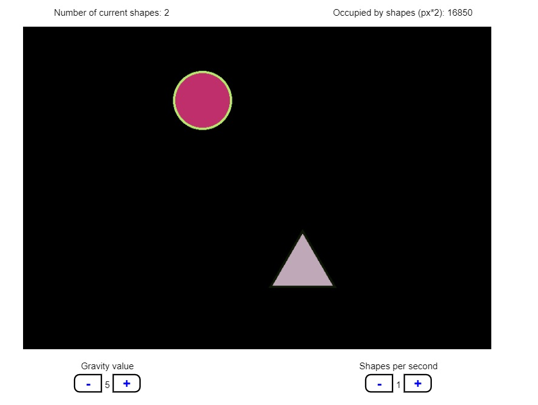
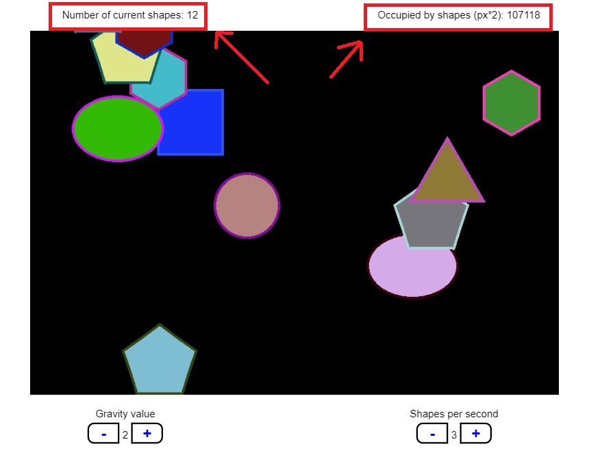
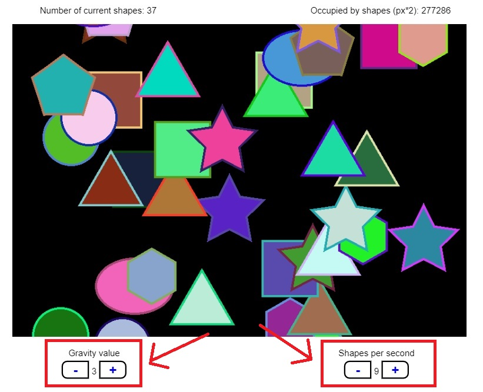

# Test Project with PIXI.js

## About app

There is  the rectangular area
Inside the rectangular area is generate random shapes with random colours. 
The shapes is fall down from top to bottom. The falling is controlled by the Gravity Value,
If you click inside the rectangle, a random shape of random colour will be
generated at mouse position and start falling. 
 
If you click a shape, it will disappear.

In the top  you see the number of shapes being displayed in the rectangle and the area,
in pixels, that all the shapes in the field occupy. 
 

In the bottom you have a couple of controls, with their help you can
increase/decrease the number of shapes generated per second and
increase/decrease the gravity value
 

## For watch project online

You can try to play now [Here](https://mystifying-wright-7a2338.netlify.com)

## For start project in you computer

## Available Scripts

In the project directory, you can run:

### `npm start`

Runs the app in the development mode. 
Open [http://localhost:1234](http://localhost:1234) to view it in the browser.

The page will reload if you make edits. 
You will also see any lint errors in the console.

### `npm run build`

Builds the app for production to the `dist` folder. 
